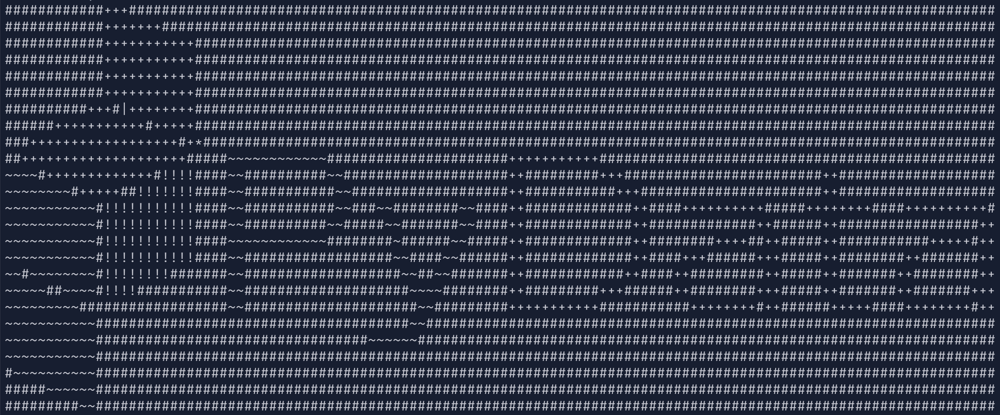
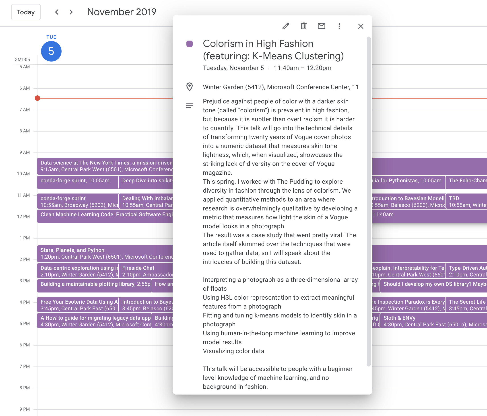
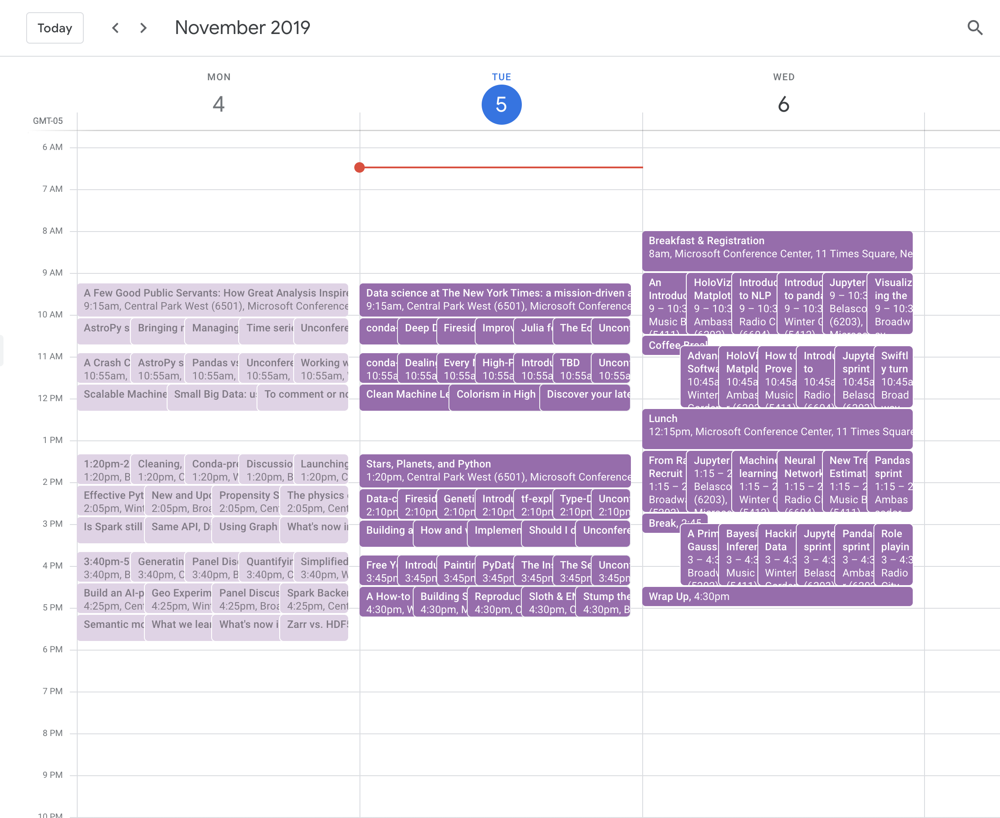

<h1 align="center">Welcome to PyDataScheduler 👋</h1>

  
  
  

> A Google Calendar API scheduler for (and data visualization/analysis of talks at) PyData NYC 

### 🏠 [Homepage](https://github.com/lorarjohns/PyDataScheduler)

### ✨ [Demo](https://github.com/lorarjohns/PyDataScheduler)

## Author

👤 **Lora Johns**

* Website: www.lorajohns.com
* Twitter: [@lorarjohns](https://twitter.com/lorajohns)
* Github: [@lorarjohns](https://github.com/lorarjohns)

## Show your support

Give a ⭐️ if this project helped you!

***
_This README was generated with ❤️ by [readme-md-generator](https://github.com/kefranabg/readme-md-generator)_